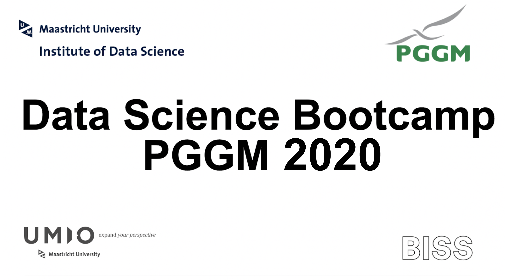

# PGGM Bootcamp

#### Work materials for the Data Science Bootcamp at PGGM

---
#### Materials

[Jupyter Notebook Guide](bit.ly/2RkqKMa)   

[Notebook 3](http://bit.ly/bootcamp_notebook_3)  
[Notebook 2](http://bit.ly/bootcamp_notebook2)  
[Notebook 1](http://bit.ly/bootcamp_notebook1)  
[Assignment 3](http://bit.ly/bootcamp_ex3)  
[Assignment 2](http://bit.ly/bootcamp_ex2)  
[Assignment 1](http://bit.ly/bootcamp_ex1)  
[Book](http://bit.ly/2RJCXx3)  
[PGGM company data](http://bit.ly/PGGM_dataset)  
[Airbnb A'dam data](http://bit.ly/airbnb_ams_dataset)  
 
#### External sources
- https://towardsdatascience.com/python-for-finance-stock-portfolio-analyses-6da4c3e61054  
- https://towardsdatascience.com/efficient-frontier-optimize-portfolio-with-scipy-57456428323e  
- http://wavedatalab.github.io/datawithpython/timeseries.html  
- https://github.com/kdboller/pythonsp500-plotly-dash  
- https://www.alphavantage.co/  
- https://www.worldtradingdata.com/  

### General repositories with data science materials

* https://github.com/firmai/industry-machine-learning
* https://github.com/TarrySingh/Artificial-Intelligence-Deep-Learning-Machine-Learning-Tutorials
* https://github.com/rhiever/Data-Analysis-and-Machine-Learning-Projects
* https://github.com/drivendata/data-science-is-software
* https://ebookfoundation.github.io/free-programming-books/
* https://github.com/awesomedata/awesome-public-datasets
* https://www.tcs.com/content/dam/tcs/pdf/Industries/Banking%20and%20Financial%20Services/analytics-artificial-intelligence-machine-learning-0817-1.pdf
* https://igniteoutsourcing.com/fintech/machine-learning-in-finance/
* https://emerj.com/ai-sector-overviews/machine-learning-in-investment-management-and-asset-management/
* https://github.com/StephenElston/ExploringDataWithPython
* https://github.com/StephanieStallworth/Exploratory_Data_Analysis_Visualization_Python

### Cheatsheets

[MaastrichtU-IDS/cheatsheets](https://maastrichtuniversity-ids-open.s3.eu-central-1.amazonaws.com/data-science-cheatsheets.zip)

---

Disclaimer: The data sources and libraries are either open available or made up.
